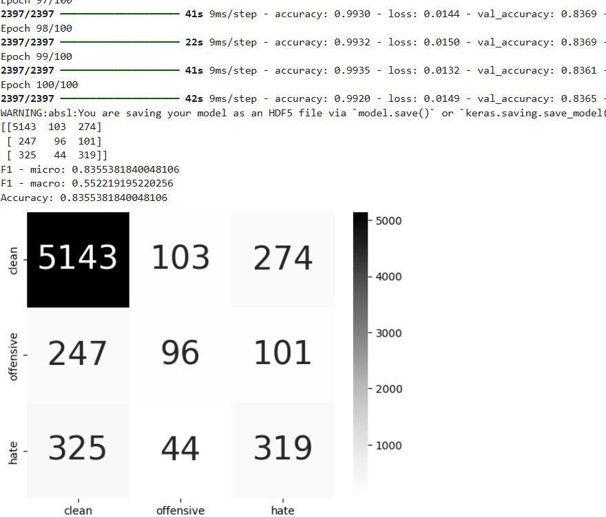

<h1 align="center">PHÂN TÍCH CẢM XÚC QUA BÀI ĐĂNG TRÊN MXH</h1>

<div align="center">

<p align="center">
  
  
</p>

[](https://www.facebook.com/DNUAIoTLab)
[](https://fitdnu.net/)
[](https://dainam.edu.vn)

</div>

<h2 align="center">Mô hình phát hiện cảm xúc qua bài đăng trên mxh sử dụng cấu trúc CNN</h2>

<p align="left">
Phân tích cảm xúc giúp xác định thái độ của người dùng (tích cực, tiêu cực, trung lập) trong văn bản. Mô hình CNN, thường dùng trong xử lý hình ảnh, có thể áp dụng cho văn bản bằng cách trích xuất đặc trưng từ chuỗi từ. Khi được huấn luyện trên dữ liệu văn bản, CNN có khả năng nhận diện cảm xúc nhanh và chính xác, giúp doanh nghiệp hiểu phản hồi khách hàng và điều chỉnh chiến lược phù hợp.

</p>

---

## 🌟 Giới thiệu

- **Mô hình nhận diện** Mô hình sẽ nhận diện thông qua văn bản và trả về kết quả.
- **💡 Thông báo:** Khi nhận dạng được nếu mô hình nhận dạnh được đó là cảm xúc tiêu cực hay  tích cực.
<!-- - **📊 Quản lý dữ liệu:** Dữ liệu điểm danh được lưu trong MongoDB, có thể xem lịch sử và xuất ra file CSV.
- **🖥️ Giao diện thân thiện:** Sử dụng Tkinter cho giao diện quản lý và Flask cho xử lý điểm danh qua web. -->
<!-- 
---
## 🏗️ HỆ THỐNG
<p align="center">
  
</p> -->
<!-- ### 📽️ Video giới thiệu

[](https://drive.google.com/file/d/1HvBPPRdxFYG13r6tVnW1RFvl2_G_gxUs/view?usp=sharing) -->

## 👨‍🏫 Thành viên:
<div align="center"><br>

  
| MSV        | Họ và tên           | Tên trường           |
| :--------- | :------------------ | :------------------- |
| 1771020734 | Đỗ Văn Tuyên   | Dai Nam Unversity  |
| 1771020688 | Nguyễn Thành Trung	    | Dai Nam University  |
| 1771020664 | Bùi Việt Tiến | Dai Nam University  |
<br>

</div>
---

## 📂 Cấu trúc dự án

📦 Project  
├── 📂 data  # Thư mục chứa Dữ liệu video<br>
├── 📂 Models  # Thư mục chứa mô hình đã được huấn luyện xong<br>
├── 📂 Note  # Thư mục chứa thông tin liên quan phục vụ cho  README  <br>
├── 📂 vec  # Thư mục chứa Dữ liệu tiếng việt đã được chuyển sang vecter<br>
├── 📂 tokenizer  # Thư mục chứa file thông tin về ngữ nghĩa tiếng việt <br>
├── 📂 vietnamese  # Thư mục chứa file viết tắt tiếng việt <br>
├── 📄 [[requiment.txt](requiment.txt)]  # File Setup các thư viên<br>
├── 📄 [[.gitignore](.gitignore)]  # File chứa thông tin file không muốn đẩy lên git<br>
├── 📄 [[train_readme.py](train_readme.py)]# File Setup các thư viên<br>
├── 📄 [[train.py](train.py)]# File chứa mã code huấn luyện mô hình <br>
├── 📄 [[useV1.py](useV1.py)]# File chứa mã nguồn sử dụng mô hình sau khi huấn luyện xong<br>
├── 📄 [[useV2.py](useV2.py)]# File chứa mã nguồn sử dụng mô hình sau khi huấn luyện xong cải tiến<br>


## 🛠️ CÔNG NGHỆ SỬ DỤNG

<div align="center">
<!-- 
### 📡 Phần cứng
[](https://www.arduino.cc/)
[]()
[]()
[]() -->

### 🖥️ Phần mềm
[]()

[]()
[]()

</div>

## 🛠️ Yêu cầu hệ thống

<!-- ### 🔌 Phần cứng
- **Arduino Uno** (hoặc board tương thích) với **LED (2 màu) và còi**.
- **Cáp USB** để kết nối Arduino với máy tính.
- ⚠️ **Lưu ý:** Mặc định mã nguồn Arduino trong `ThongBao.ino` sử dụng cổng `COM5`. Nếu Arduino của bạn sử dụng cổng khác, hãy thay đổi biến `SERIAL_PORT` trong `chuongTrinh.py`. -->

### 💻 Phần mềm
- **🐍 Python 3+**
- **⚡ Model** Yêu cầu phải có models đã huấn luyện rồi mới có thể dùng được.

### 📦 Các thư viện Python cần thiết
Cài đặt môi trường ảo và các thư viện bằng lệnh:

#### Môi trường ảo:

-Bước 1:Tao môi trường ảo + tên môi trường
```bash
python -m venv env_mxh
```
-Bước 2:Truy vập Môi trường
```bash
cd env_mxh/Scripts
```
-Bước 3: Kích hoạt  môi trường
```bash
activate.bat
```
-Nếu bạn muốn tắt môi trường ảo:
```bash
deactivate.bat 
```

>  Cài đặt  thư  viên  cần thiết 
#### Cài thư viện (pip)
```bash
pip install -r requiment.txt
``` 
## 🚀 Hướng dẫn cài đặt và chạy
1️⃣ Kích hoạt môi trường ảo
- Để kích hoạt môi trường ảo [Xem tại đây](#-các-thư-viện-python-cần-thiết)

2️⃣ Cài đặt thư viện Python. 

Cài đặt Python 3 nếu chưa có, sau đó cài đặt các thư viện cần thiết [Ở đây](#-các-thư-viện-python-cần-thiết)

3️⃣  Chạy chương trình huấn luyện mô hình

  Huấn luyện mô hình [Tại đây](train.py) # Các file đã được giải thích kĩ bên trên
👉 Lưu ý:

 - Dữ liệu huấn luyện phải nằm trong thư mục Data/

 - Thay đổi các tham số huấn luyện (Length, epoch, learning_rate...) trong các file train nếu cần thiết.
 --- 
## 📌 CÀI ĐẶT VÀ SỬ DỤNG MÔ HÌNH ĐÃ HUẤN LUYỆN

1️⃣ Cấu trúc thư mục quan trọng

 - Models/ ➝ Chứa các mô hình đã huấn luyện


2️⃣ Sử dụng mô hình đã huấn luyện

- Chạy mô hình CNN [Tại đây ](useV1.py)
- Chạy mô hình CNN cải tiến [Tại đây ](useV2.py)

👉 Lưu ý:

 - Kiểm tra đường dẫn đến file mô hình (Models/) trước khi chạy.

 - Đảm bảo dữ liệu đầu vào có định dạng phù hợp.


## Kết quả huấn luyện mô hình:
<div  align="center">
<br>



</div>
### Kết quả

---

## 🤝 Đóng góp
Dự án được phát triển bởi 3 thành viên:
<div align="center">
  <br> 
  
| Họ và Tên       | Vai trò                  |
|---------------------------|-----------------------|
|Đỗ Văn Tuyên | Phát triển toàn bộ mã nguồn , viết overleaf, thuyết trình, tìm kiếm dataset, thiết kế power point|
| Nguyễn Thành Trung |Hỗ trợ bài tập lớn|
| Bùi Việt Tiến   | Hỗ trợ bài tập lớn|

<br>

© 2025 NHÓM 8, CNTT17-15, TRƯỜNG ĐẠI HỌC ĐẠI NAM
</div>


